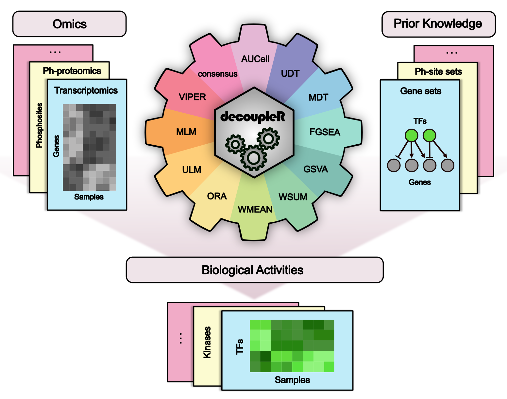

## Overview

Many methods allow us to extract biological activities from omics data
using information from prior knowledge resources, reducing the
dimensionality for increased statistical power and better
interpretability. Here, we present **decoupleR**, a Bioconductor package
containing different statistical methods to extract these signatures
within a unified framework. decoupleR allows the user to flexibly test
any method with any resource. It incorporates methods that take into
account the sign and weight of network interactions. decoupleR can be
used with any omic, as long as its features can be linked to a
biological process based on prior knowledge. For example, in
transcriptomics gene sets regulated by a transcription factor, or in
phospho-proteomics phosphosites that are targeted by a kinase.

For more information about how this package has been used with real
data, please check the following links:

-   [decoupleR's manuscript
    repository](https://github.com/saezlab/decoupleR_manuscript)

-   [Creation of benchmarking
    pipelines](https://github.com/saezlab/decoupleRBench)

-   [Example of Kinase and TF activity
    estimation](https://saezlab.github.io/kinase_tf_mini_tuto/)
